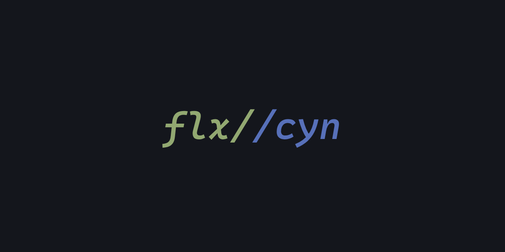

    
    
    

    <a href="https://www.moritzjung.dev/obsidian-stats/themes/flexcyon">
    
    
    

    
    

 

    

## About Flexcyon

A Obsidian theme combining the colour schemes of Halcyon and Flexoki.

I really liked the vibrant colours of the
[Halcyon colour scheme](https://halcyon-theme.netlify.app/), and the inky
aesthetic of the [Flexoki colour scheme](https://stephango.com/flexoki). Hence,
I decided to combine the two which started this theme.

There is also a light mode colour scheme combining
[Origami theme's](https://github.com/7368697661/Origami) and Flexoki light's
colour schemes.

## Installation via community store (recommended)

To install this theme via the community store, navigate to `Settings > Appearance`

1. Under `Themes`, click Manage
2. `Type "Flexcyon" in the search bar > Select it > Click "Install and Use"`

Installation of [Style Settings](#style-settings) is highly recommended for this
theme, as most customisation and functionality is built around it.

### Installation via BRAT

To install this theme via BRAT, navigate to `Settings > Community Plugins > Browse`

1. `Type "BRAT" in the search bar > Select it (the one by TftHacker) > Click install`
2. Wait for installation to complete then click `Enable`
3. Click `Options`
4. Click `Add Beta Theme`
5. Input `https://github.com/bladeacer/flexcyon` and then click `Add Theme`

### Supported versions

Flexcyon is officially supported from [Obsidian Version 1.6.3](https://obsidian.md/changelog/2024-06-08-desktop-v1.6.3/)
onwards.

[Obsidian 1.6](https://obsidian.md/changelog/2024-06-07-desktop-v1.6.2/) and above
was chosen to be the minimum version supported as support for RTL languages was
added then.

Beta or insider versions of Obsidian will not be officially supported, although
the theme should (hopefully) not break too much.
> If significant issues are found, do open an issue here. I (bladeacer) will try
> to troubleshoot them once the beta or insider version of Obsidian has a public
> equivalent.

You can also find this in the documentation.

## Documentation

Huge thanks to GitHub Pages for [hosting the documentation](https://flexcyon.github.io/docs-en/).

如果您更熟悉中文, 请 [单击此处](https://flexcyon.github.io/docs-en/zh/) 查看中文文档.

## Design Principles

This theme tries to:

- be "reasonably opinionated"
  - Choose between the opinionated Flex Max mode
  - or customising the theme extensively
  - Opt into customisations you choose instead of opting out
- be decently lightweight, meaning:
  - fonts, svgs and the like are not embedded in this theme
  - (hopefully) sane defaults, customisable with style settings
- dim inactive or unfocused UI elements to reduce information overload
- have a decent feature set of style settings for customisation
- bundle numerous callout metadata utilites

## Features

Refer to the documentation for the full set of features in Flexcyon.

#### What this theme has

- vim mode status (when using builtin vim keybinds)
- Status bar options like Powerlevel10k inspired status bar styling
- Smiley toggle icons and other options for settings
- ASCII art or custom quote in new empty tabs
- subtle opacity effects for UI elements
- a light and dark mode colour scheme
- ASCII checkboxes
- Heading options like underline, numbered, coloured
- A plethora of cssclasses and callout customisation options
- A [plethora of cssclasses and callout customisation options](https://flexcyon.github.io/docs-en/Styling/CSS-Classes/)
- Workspace Layouts like card layout with TUI inspired add-on, angled layout
- Configure left, right sidebar and modal background images
- Animation options for tabs
- And many more...

#### What this theme does not have

- multiple colour schemes (though you can override the existing one with your own, see [Style Settings](#style-settings))
- alternate checkboxes
- embedded fonts, svgs

#### Supported plugins/snippets

View [supported plugins and snippets here](https://flexcyon.github.io/docs-en/README/page-3/)

For plugins/snippets that are not styled yet, feel free to open a Pull Request/Feature Request/start a Discussion on it.

#### Snippet collection

Some of the theme's snippets like ASCII Art and its callouts can be [found here](https://github.com/bladeacer/obsi-snip-coll).

#### Questions, Issues?

Feel free to talk about it at:

- [this Matrix Space](https://matrix.to/#/#flexcyon-space:matrix.org)
- [this Obsidian forum topic](https://forum.obsidian.md/t/flexcyon-a-dark-theme-for-obsidian/99869)
- [this Discord thread](https://discord.com/channels/686053708261228577/1338130333698359357)
- [start a GitHub discussion](https://github.com/bladeacer/flexcyon/discussions)

Methods of communication are listed in order of preference.

## Contributing

Refer to the [documentation on contributing](https://flexcyon.github.io/docs-en/contributing/).

## Style Settings

Documentation for style settings of this theme can be found [here](https://flexcyon.github.io/docs-en/Styling/Style-Settings/).

Documentation on installing and using style settings can be found [here](https://github.com/mgmeyers/obsidian-style-settings).

## License

This theme is licensed under the [MIT License](https://github.com/bladeacer/flexcyon/blob/master/LICENSE).

## Credits

Without these [contributors](https://flexcyon.github.io/docs-en/credits/) and [tools](https://flexcyon.github.io/docs-en/credits/page-1/), flexcyon would not be possible.

The code of conduct was adopted from the
[Contributor Covenant](https://www.contributor-covenant.org/)

The contributing guide was adopted from [conduct](https://github.com/sindresorhus/conduct)
