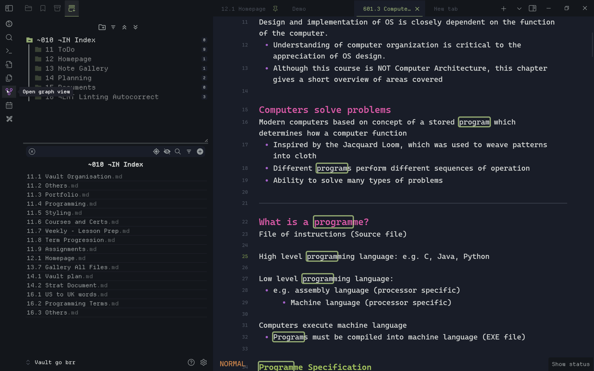
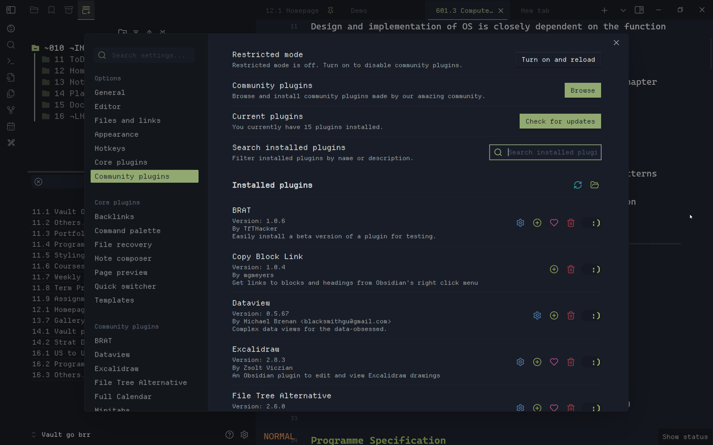

    
    
    

## About Flexcyon
A Obsidian theme combining the colour schemes of Halcyon and Flexoki.

I really liked the vibrant colours of the [Halcyon colour scheme](https://halcyon-theme.netlify.app/), and the inky aesthetic of the [Flexoki colour scheme](https://stephango.com/flexoki). Hence, I decided to combine the two which started this theme.

## Screenshots

## Installation via community store (recommended)
To install this theme via the community store, navigate to  `Settings > Appearance`
1. Under `Themes`, click Manage
2. `Type "Flexcyon in the search bar > Select it > Click "Install and Use"`

### Installation via BRAT
To install this theme via BRAT, navigate to `Settings > Community Plugins > Browse` 
1. `Type "BRAT" in the search bar > Select it (the one by TftHacker) > Click install`
2. Wait for installation to complete then click `Enable`
3. Click `Options`
4. Click `Add Beta Theme`
5. Input `https://github.com/bladeacer/flexcyon` and then click `Add Theme`

## Features
#### What this theme has
- vim mode status (when using builtin vim keybinds)
- Status bar options like Powerlevel10k inspired status bar styling
- Smiley toggle icons and other options for settings
- ASCII art or custom quote in new empty tabs
- subtle opacity effects for UI elements
- a dark mode colour scheme
- ASCII checkboxes 
- Heading options like underline, numbered, coloured
- A [plethora of cssclasses and callout customisation options](https://github.com/bladeacer/flexcyon/tree/master/docs/cssclasses.md)
- Workspace Layouts like card layout with TUI inspired add-on, angled layout
- Configure left, right sidebar and modal background images
- Animation options for tabs 
- And many more...

#### What this theme does not have
- multiple colour schemes (though you can override the existing one with your own, see [Style Settings](#style-settings))
- a light mode colour scheme :)
- alternate checkboxes
- embedded fonts, svgs

#### Supported plugins/snippets
The following plugins/snippets are officially supported:
##### Plugins
- [File Tree Alternative by Ozan Tellioglu](https://github.com/ozntel/file-tree-alternative)
- [Highlightr by Chetachi](https://github.com/chetachiezikeuzor/Highlightr-Plugin)
- [Minitabs by ssjy1919](https://github.com/ssjy1919/Obsidian-minitabs)
- [Full Calendar by Davis Haupt](https://github.com/obsidian-community/obsidian-full-calendar)
- [Breadcrumbs by SkepticMystic](https://github.com/SkepticMystic/breadcrumbs)
- [Spaced Repetition by Stephen Mwangi](https://github.com/st3v3nmw/obsidian-spaced-repetition)
- [Dataview by Michael Brenan](https://github.com/blacksmithgu/obsidian-dataview)
- [Vault Statistics by Bryuan Kyle](https://github.com/bkyle/obsidian-vault-statistics-plugin)
- [Calendar by Liam Cain](https://github.com/liamcain/obsidian-calendar-plugin)
- [Kanban by mgmyers](https://github.com/mgmeyers/obsidian-kanban)

##### Snippets
- [CSS Banners snippet by HandaArchitect](https://github.com/HandaArchitect/obsidian-banner-snippet)

For plugins/snippets that are not styled yet, feel free to open a PR/FR on it.

#### Recommended snippets
Here are some recommended snippets to add to your vault and use alongside Flexcyon:
- [CSS Banners snippet by HandaArchitect](https://github.com/HandaArchitect/obsidian-banner-snippet)
- [Obsidian FileLink Styling by felixqueisler](https://github.com/felixqueisler/Obsidian-FileLink-Styling)
- [MCL Multi Column and Gallery Cards by efemkay](https://github.com/efemkay/obsidian-modular-css-layout)

## Documentation
Documentation for this theme can be found [here](https://github.com/bladeacer/flexcyon/tree/master/docs/docs.md)
> If there is a new feature in the documentation that cannot be found within the theme itself, said feature are WIP and may be released next update

#### Roadmap
The Roadmap for this theme can be found [here](https://github.com/bladeacer/flexcyon/tree/master/docs/roadmap.md).

#### Changelogs
The Changelogs for this theme can be found [here](https://github.com/bladeacer/flexcyon/tree/master/docs/changelogs.md)

#### Questions, Issues?
Feel free to talk about it at [this Discord thread](https://discord.com/channels/686053708261228577/1338130333698359357). Alternatively, you can open an issue at this repository.

## Design Principles
This theme tries to:
- be "reasonably opinionated" 
- be decently lightweight, meaning:
    - fonts, svgs and the like are not embedded in this theme
    - (hopefully) sane defaults, customisable with style settings
- dim inactive or unfocused UI elements to reduce information overload
- have a decent feature set of style settings for customisation
- bundle numerous callout metadata utilites

## Style Settings
Documentation for style settings of this theme can be found [here](https://github.com/bladeacer/flexcyon/tree/master/docs/style_settings.md)

Documentation on installing and using style settings can be found [here](https://github.com/mgmeyers/obsidian-style-settings)

## License
This theme is licensed under the [MIT License](https://github.com/bladeacer/flexcyon/blob/master/LICENSE)

## Credits
A huge shout out to Daniel's [Halcyon theme](https://github.com/dbarenholz/halcyon-obsidian) and kepano's [flexoki](https://github.com/kepano/flexoki-obsidian) theme, both of which are under the MIT license.

#### Snippets
- `@OWA/bennyyip` on the Obisidian Members' Group Discord for the tategaki snippet
- [Ukiyo](https://github.com/technerium/obsidian-ukiyo) Theme by vaykinov and wizentex for the popup callout
- `@Kapirklaa` on the Obisidian Members' Group Discord (@ElsaTam on GitHub) for the background image snippet
- `@Nuno` on the Obsidian Members' Group Discord for the tab animations snippet
<!-- - [Enhanced File Explorer Theme] by LennZone for the markdown file tree style -->

#### Ideas, Feedback
- `@Tuck` on the Obsidian Members' Group Discord for options to change link color and indentation of Style Settings headings
- `@Floodlight` on the Obisidian Members' Group Discord for better consistency of active navigation items
- `@TundraMoonlight` on the Obisidian Members' Group Discord for inspiration for the TUI add-on
- `@Kapirklaa` on the Obisidian Members' Group Discord (@ElsaTam on GitHub) for inspiration for callout metadata utilities
- `@BEN10` on the Obisidian Members' Group Discord for fixes to the documentation, Powerlevel10k layout