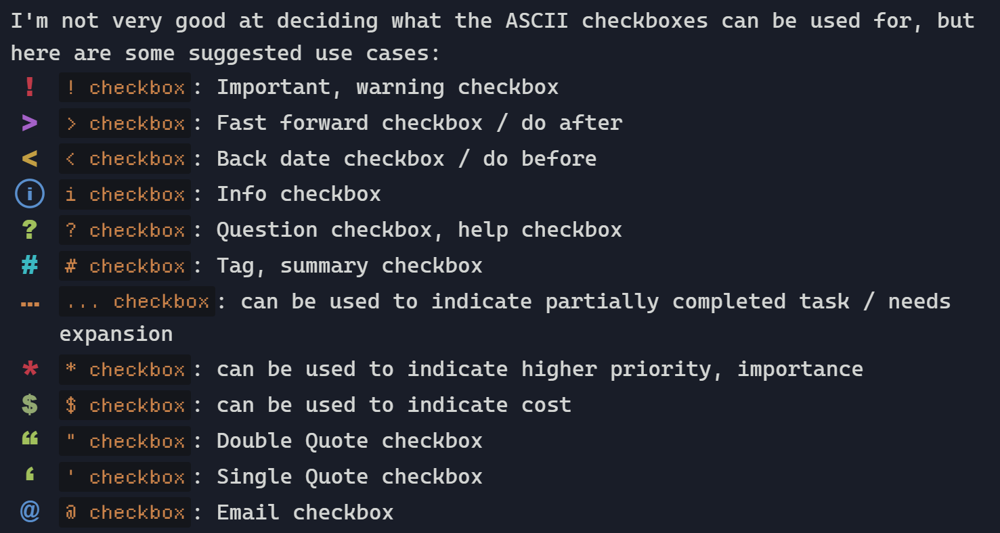

    
    
    

    
    

 

    

    

## About Flexcyon

A Obsidian theme combining the colour schemes of Halcyon and Flexoki.

I really liked the vibrant colours of the
[Halcyon colour scheme](https://halcyon-theme.netlify.app/), and the inky
aesthetic of the [Flexoki colour scheme](https://stephango.com/flexoki). Hence,
I decided to combine the two which started this theme.

There is also a light mode colour scheme combining
[Origami theme's](https://github.com/7368697661/Origami) and Flexoki light's
colour schemes.

## Screenshots

    
    

    
    

    

## Installation via community store (recommended)

To install this theme via the community store, navigate to `Settings > Appearance`

1. Under `Themes`, click Manage
2. `Type "Flexcyon in the search bar > Select it > Click "Install and Use"`

Installation of [Style Settings](#style-settings) is highly recommended for this
theme, as most customisation and functionality is built around it.

### Installation via BRAT

To install this theme via BRAT, navigate to `Settings > Community Plugins > Browse`

1. `Type "BRAT" in the search bar > Select it (the one by TftHacker) > Click install`
2. Wait for installation to complete then click `Enable`
3. Click `Options`
4. Click `Add Beta Theme`
5. Input `https://github.com/bladeacer/flexcyon` and then click `Add Theme`

## Documentation

A huge thanks to GitHub Pages for [hosting the documentation](https://flexcyon.github.io/docs-en/).

如果您更熟悉中文, 请 [单击此处](https://flexcyon.github.io/docs-en/zh/) 查看中文文档。

## Design Principles

This theme tries to:

- be "reasonably opinionated"
  - Choose between the opinionated Flex Max mode
  - or customising the theme extensively
  - Opt into customisations you choose instead of opting out
- be decently lightweight, meaning:
  - fonts, svgs and the like are not embedded in this theme
  - (hopefully) sane defaults, customisable with style settings
- dim inactive or unfocused UI elements to reduce information overload
- have a decent feature set of style settings for customisation
- bundle numerous callout metadata utilites

## Features

Refer to the documentation for the full set of features in Flexcyon.

#### What this theme has

- vim mode status (when using builtin vim keybinds)
- Status bar options like Powerlevel10k inspired status bar styling
- Smiley toggle icons and other options for settings
- ASCII art or custom quote in new empty tabs
- subtle opacity effects for UI elements
- a light and dark mode colour scheme
- ASCII checkboxes
- Heading options like underline, numbered, coloured
- A plethora of cssclasses and callout customisation options
- A [plethora of cssclasses and callout customisation options](https://flexcyon.github.io/docs-en/Styling/CSS-Classes/)
- Workspace Layouts like card layout with TUI inspired add-on, angled layout
- Configure left, right sidebar and modal background images
- Animation options for tabs
- And many more...

#### What this theme does not have

- multiple colour schemes (though you can override the existing one with your
  own, see [Style Settings](#style-settings))
- alternate checkboxes
- embedded fonts, svgs

#### Supported plugins/snippets

View [supported plugins and snippets here](https://flexcyon.github.io/docs-en/README/page-3/)

For plugins/snippets that are not styled yet, feel free to open a Pull Request/
Feature Request/start a Discussion on it.

#### Snippet collection

Some of the theme's snippets like ASCII Art and its callouts can be [found here](https://github.com/bladeacer/obsi-snip-coll).

#### Questions, Issues?

Feel free to talk about it at:

- [this Discord thread](https://discord.com/channels/686053708261228577/1338130333698359357).
- [this Obsidian forum topic](https://forum.obsidian.md/t/flexcyon-a-dark-theme-for-obsidian/99869)

## Contributing

Alternatively, you can open an issue at
[the repository](https://github.com/bladeacer/flexcyon/issues) or
[start a GitHub discussion](https://github.com/bladeacer/flexcyon/discussions) here.

Do note that this repository has its own [Code of Conduct](./CODE_OF_CONDUCT.md)
and [Contributing Guide](./CONTRIBUTING.md).

## Style Settings

Documentation for style settings of this theme can be found [here](https://flexcyon.github.io/docs-en/Styling/Style-Settings/)

Documentation on installing and using style settings can be found [here](https://github.com/mgmeyers/obsidian-style-settings)

## License

This theme is licensed under the [MIT License](https://github.com/bladeacer/flexcyon/blob/master/LICENSE)

## Credits

Without these [contributors](https://flexcyon.github.io/docs-en/credits/) and
[tools](https://flexcyon.github.io/docs-en/credits/page-1/), flexcyon would not
be possible.

The code of conduct was adopted from the
[Contributor Covenant](https://www.contributor-covenant.org/)

The contributing guide was adopted from [conduct](https://github.com/sindresorhus/conduct)

<!--- For pre-commit hooks, view https://prettier.io/docs/precommit --->
