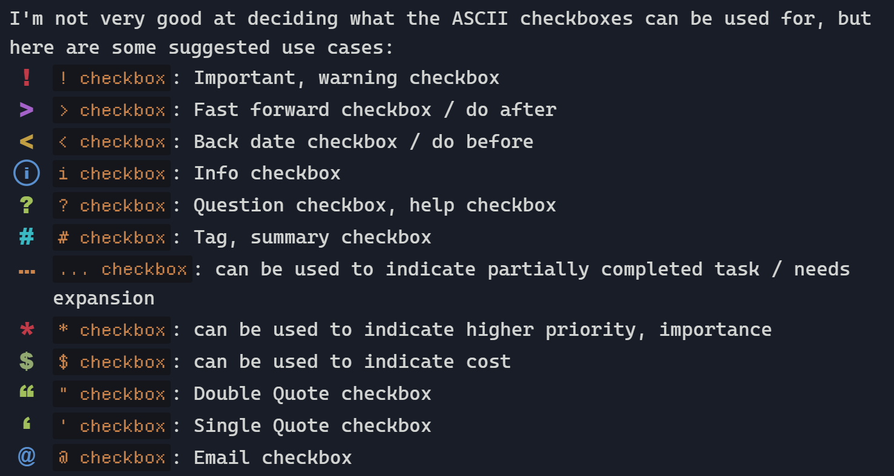

## About Flexcyon
A Obsidian theme combining the colour schemes of Halcyon and Flexoki.

I really liked the vibrant colours of the [Halcyon colour scheme](https://halcyon-theme.netlify.app/), and the inky aesthetic of the [Flexoki colour scheme](https://stephango.com/flexoki). Hence, I decided to combine the two which started this theme.

## Features
#### What this theme has
- vim mode status (when using builtin vim keybinds)
- Status bar options like Powerlevel10k inspired status bar styling
- Smiley toggle icons and other options for settings
- ASCII art or custom quote in new empty tabs
- subtle opacity effects for UI elements
- a dark mode colour scheme
- ASCII checkboxes 
- Heading options like underline, numbered, coloured
- A [plethora of cssclasses and callout customisation options](https://github.com/bladeacer/flexcyon/tree/master/docs/cssclasses.md)
- Workspace Layouts like card layout with TUI inspired add-on, angled layout
- Configure left, right sidebar and modal background images
- Animation options for tabs 
- And many more...

###### Easter Egg
1. Enable Easter Egg mode in Style Settings to start.
2. Total of 5 challenges to uncover. Once a challenge is done, it will provide a hint to the next challenge at the bottom right of the screen in Obsidian (outside of source mode).
3. As I cannot and will not obsfucate the source code. Please do not clone the repository and search up for the answers :)
4. The first 5 to DM me on Discord (user `@data_in_void`) with the full set of hints and their corresponding answers (in correct order) for each of the challenges will get a shoutout in this README.

The hint for the first challenge is: colors of pi. Good luck!

**Disclaimer: Either back up your vault's Style Settings or do the challenges in a test vault, as they may mess with your existing configurations.**

#### What this theme does not have
- multiple colour schemes (though you can override the existing one with your own, see [Style Settings](#style-settings))
- a light mode colour scheme :)
- alternate checkboxes
- embedded fonts, svgs

#### Recommended snippets
Here are some recommended snippets to add to your vault and use alongside Flexcyon:
- [CSS Banners snippet by HandaArchitect](https://github.com/HandaArchitect/obsidian-banner-snippet)
- [Obsidian FileLink Styling by felixqueisler](https://github.com/felixqueisler/Obsidian-FileLink-Styling)
- [MCL Multi Column and Gallery Cards by efemkay](https://github.com/efemkay/obsidian-modular-css-layout)

## Documentation
Documentation for this theme can be found at https://flexcyon.readthedocs.io/en/latest/  (WIP)
A huge thanks to ReadTheDocs for hosting the documentation
- WIP atm: https://flexcyon.readthedocs.io/en/latest/ 

> If there is a new feature in the documentation that cannot be found within the theme itself, said feature are WIP and may be released next update

#### Roadmap
The Roadmap for this theme can be found [here](https://github.com/bladeacer/flexcyon/tree/master/docs/roadmap.md).

#### Changelogs
The Changelogs for this theme can be found [here](https://github.com/bladeacer/flexcyon/tree/master/docs/changelogs.md)

#### Questions, Issues?
Feel free to talk about it at [this Discord thread](https://discord.com/channels/686053708261228577/1338130333698359357). Alternatively, you can open an issue at this repository.

## Design Principles
This theme tries to:
- be "reasonably opinionated" 
- be decently lightweight, meaning:
    - fonts, svgs and the like are not embedded in this theme
    - (hopefully) sane defaults, customisable with style settings
- dim inactive or unfocused UI elements to reduce information overload
- have a decent feature set of style settings for customisation
- bundle numerous callout metadata utilites

## Style Settings
Documentation for style settings of this theme can be found [here](https://github.com/bladeacer/flexcyon/tree/master/docs/style_settings.md)

Documentation on installing and using style settings can be found [here](https://github.com/mgmeyers/obsidian-style-settings)

## License
The license for the theme can be found [here](../license.md)